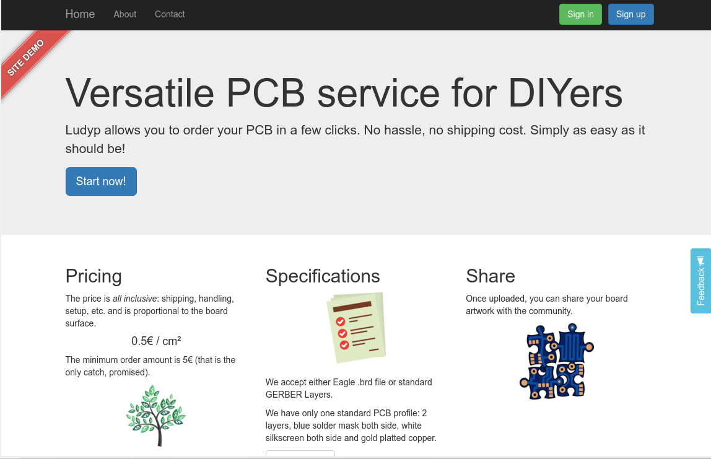
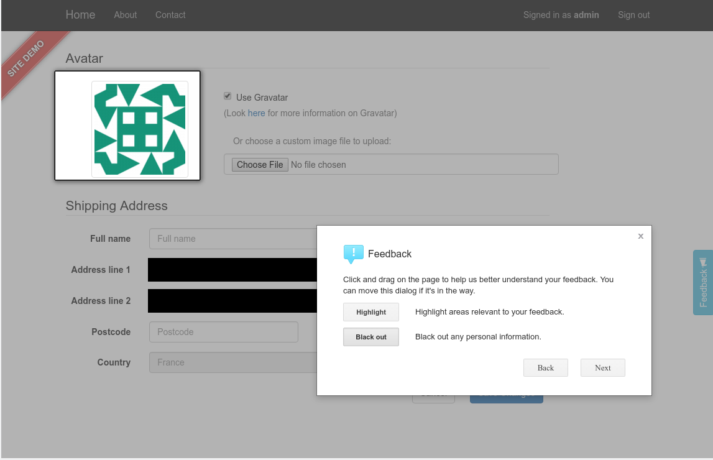
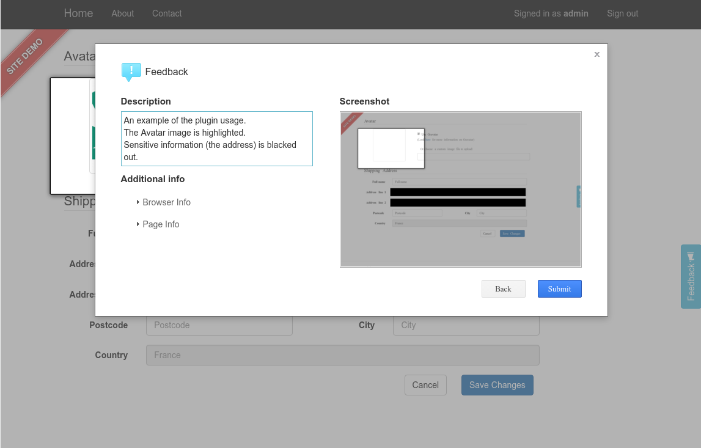
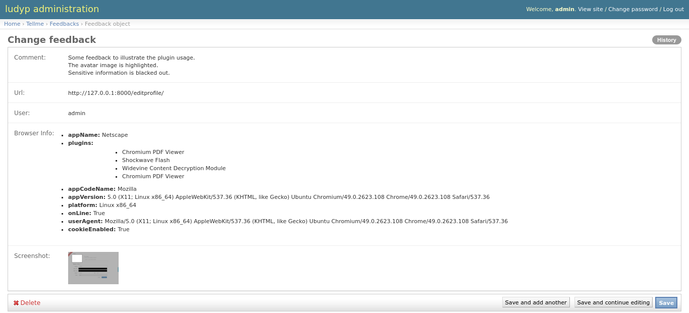

.. image:: https://img.shields.io/pypi/v/django-tellme.svg
    :target: https://pypi.python.org/pypi/django-tellme/

.. image:: https://img.shields.io/github/license/ludrao/django-tellme.svg 
    :target: https://en.wikipedia.org/wiki/BSD_licenses

======
tellme
======

tellme is a simple Django app that provides an easy and simple feedback button, form and admin view.

Features
--------

* Take a screenshot of the current page.
* The user can then highlight or black out portions of that screenshot
* The user have to provide textual comments, (effectively giving his feedback)
* Some additional information collected with the feedback
    * various browser information (versions, user agent, etc.)
    * user information if the user is logged in (and your site uses Django auth system)
    * the url the user provides feedback on
* Optionally, send an email to the site admin when a feedback is posted
* Supports localization (currently supported languages are English and French, translation contrib are welcomed!)
* Customizable UI by redefining templates

The javascript part of this app is using feedback.js from https://github.com/ivoviz/feedback.
feedback.js itself use html2canvas.js (https://github.com/niklasvh/html2canvas) to make page screenshot that is sent
with the feedback comments.

Dependencies
------------

This application depends on
    - python 3 (might work on python 2, but untested)
    - django >= 1.8
    - jquery must be enabled in your pages
    - Promises polyfill for IE (including IE11!) (can use that: https://github.com/stefanpenner/es6-promise)

Quick start
-----------

0. Install the app in your environment:

.. code:: bash

    pip install django-tellme

1. Add "tellme" to your INSTALLED_APPS setting like this:

.. code:: python

    INSTALLED_APPS = [
        ...
        'tellme',
    ]

2. Include the tellme URLconf in your project urls.py like this:

.. code:: python

    url(r'^tellme/', include("tellme.urls")),

Note: to not set a namespace here, django-tellme does it itself in its urls file.

3. Run ``python manage.py migrate`` to create the tellme model in the database.

4. Add a feedback button in your pages so that user can provide feedback

For example using bootstrap CSS this code would overlay a button, vertically aligned on the middle of the
page, right-aligned.

In your html/template file, import the form CSS:

.. code:: html

    <link href="" rel="stylesheet">

In your html/template file, inside the <body> section:

.. code:: html

    <button type="button" id="feedback-btn" class="btn btn-info vertical-right-aligned">
        Feedback 
    </button>

Note: the CSS class vertical-right-aligned is not from bootstrap, it is defined as:

.. code:: css

    .vertical-right-aligned {
        transform: rotate(-90deg);
        transform-origin: 100% 100%;
        position: fixed;
        right: 0;
        top: 50%;
        z-index: 100;
    }

In your html/template file, in the page footer, connect that button to the feedback plugin:

.. code:: html

    

Look into this template file, it includes a few things that can be overridden (using the Django template  mechanism), or simply redefined it in your page. What js_inc.html contains by default:

    - Load jquery plugin
    - Add CSRF automatically to all AJAX post request
    - Enable the JS feedback plugin using customizable template for each feedback step

This js_inc.html template usage is totally optional. The important part of that template is the javascript call that enables the plugin on a button:

.. code:: javascript

    
    

5. Start your site, and click the feedback button. This will pop up the feedback form. Follow the instruction, and click on **Send** when finished.

6. Visit http://127.0.0.1:8000/admin/ to review user feedback.

Some screenshots of the plugin in action
----------------------------------------

You define the feedback button that you like. In that example it is using the page theme, and is located on the middle left-side of the screen.

If a user click on it he will be able to highlight the reason of his feedback on a screenshot of the current page. He can also black out
sensitive information, if any.

Once finished and can review his feedback, add a comment and finalize the feedback.

When the feedback is sent, the site admin will receive an email with a link to the backoffice site that will allow him to learn about this feedback.
Of course, he can always go to the backoffice site in order to review the different feedback later on.

How to customize the JS feedback popup UI
-----------------------------------------

Each step of the feedback popup is an HTML UI element that can be redefined. In order to define your custom UI, you simply
have to 'overload' the template by creating, in your own app template directory, a file with the same name as the original tellme template.
The feedback popup contains 4 steps + an error screen, that can be redefined. Look for the following files:

    - tellme/tpl-description.html
    - tellme/tpl-highlighter.html
    - tellme/tpl-overview.html
    - tellme/tpl-submit-error.html
    - tellme/tpl-submit-success.html

As an easy way to start you can copy one of the above file in your template directory and modify it incrementally. Please note that you need to keep the same directory structure (i.e. tellme/tpl-xxx.html), and that your app has to be listed first in the ``INSTALLED_APPS`` list so that it takes this modified template file instead of the original tellme template file.

Email notifications
-------------------

This app can send you an email every time a feedback is posted. Currently the email is plaintext and does not contain
the screenshot. However it does contain a link to the admin site with the full details of that feedback.

To enable email notification, just add this line in your site ``settings.py``:

  .. code:: python

    TELLME_FEEDBACK_EMAIL = 'admin@tellme.com'

Important Notes
---------------

.. note::

    This app is based on feedback.js that send the feedback content using an HTTP POST method. Django uses a CSRF protection
    mechanism, that block POST request that do not contain a specific token.
    If you have not setup your page to transparently support AJAX POST here is an explanation on how to do it:
    https://docs.djangoproject.com/en/1.8/ref/csrf/#ajax

.. note::

    This app stores screenshot as part of the feedback. Those are stored as PNG image files into your MEDIA
    directory/backend.
    For this reason you need to have MEDIA_URL and MEDIA_ROOT settings available. See here for more details:
    https://docs.djangoproject.com/en/1.8/howto/static-files/

.. note::

    If using the email notification feature, make sure to setup your Email backend in django. More details here:
    https://docs.djangoproject.com/en/1.8/topics/email/

Version History
---------------

version 0.6.3
    - Added Japanese translations (thx @salexkidd)

version 0.6.2
    - Worked around an issue with scrolled page in html2canvas

version 0.6.1
    - Minor translation fixes

version 0.6
    - Minors distribution fixes
    - Updated migrations scripts

version 0.5
    *special thanks to @llann for i18n initial support*

    - Added internationalization support, defaulting to English localization.
    - Added French localization
    - Added an "include" template to simplify usage
    - Used minified version of js libraries
    - Provided a template structure so that the UI can be customized

Improving this app - TODO
-------------------------

This app was developed in rush for a simple yet complete, non intrusive, feedback tool. It does lack a lot of cool
features. If you like to contribute, please do not hesitate!

- Provide a customization mechanism for the email body, make it text+html.
- Add continuous integration testing

Translations
------------
`Transifex <https://www.transifex.com/django-tellme/django-tellme/dashboard/>`_ is used to manage translations.

Feel free to improve translations.

Currently supported languages are:
   - English
   - French
   - Japanese
   - Spanish (Initiated but need help, see on transifex site above)
   - Russian (Partial, need help see on transifex site above)

You can request to add your own language directly on Transifex.
